# TicTacToe
## Purpose of the project
The purpose of this project is to showcase the functionality of JavaScript in a website, this is done by creating a small scale TicTacToe game for users’ to play against each other. The game is able to track the players' placements on the board to identify the winner between X and O as well as is able to keep score for the players and declare which player has won or if it is a tie. 

As TicTacToe is a simple and easy game, the purpose of it needs to be that it is simple in use and navigation for users to play the game.

## User Stories
1. Game rules
- As a user I want to know how to play the game with my friend.
- As a user I want to know what to expect from the game and the output I will get.

2. The game
- As a user I want to clearly see the board at all time.
- AS a user I want to be able to choose my next move
- As a user I want to clearly see who's turn it is.
- As a user I want to clearly see who's won and how. 

3. Score
- As a user I want to be able to see the score after each round that been played
- As a user I want to have the choice between playing again or qutting.

## Features
The game has 4 sections:
- Section with Game rules
- Section with the Game board
- Section with Scores
- Section with a Thank you 

The theme of the site is blue, yellow and white/black, this theme is based on the background of the whole site
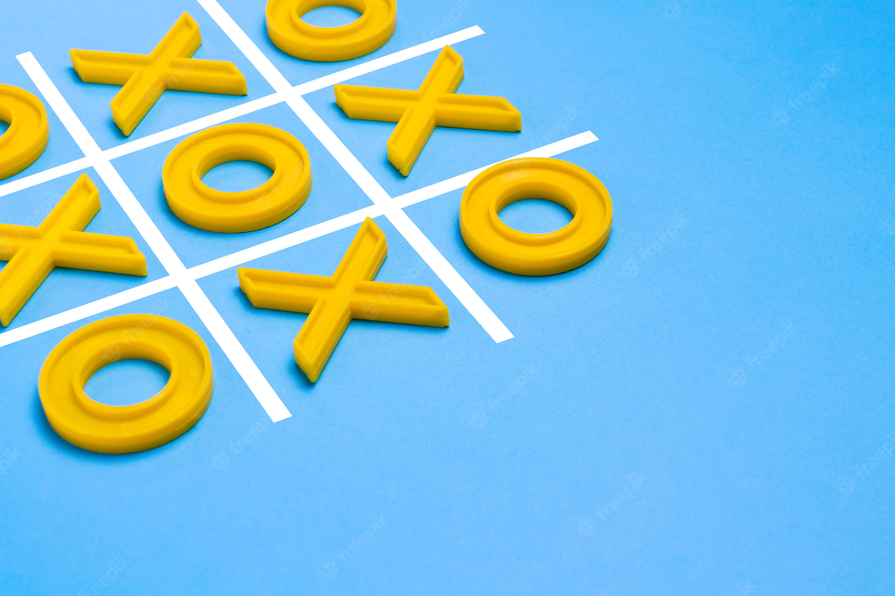

Each section contains the games title 'TicTacToe' which is a yellow 'Sriracha' font. The whole body is set to that font.
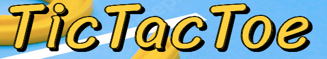

### 1. Game rules 
- The features in this section include a how to play the game information as well as at the bottom of the sentence there's a 'Play!' button that is coded to hide the rules and show the game board section.
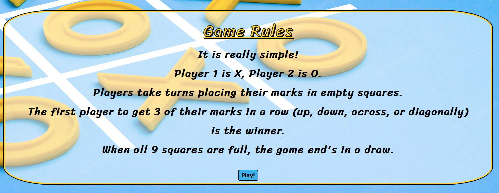

### 2.Game board
- The game has a simple 3x3 board with a little tint in each cell so that the board stand out more from the background
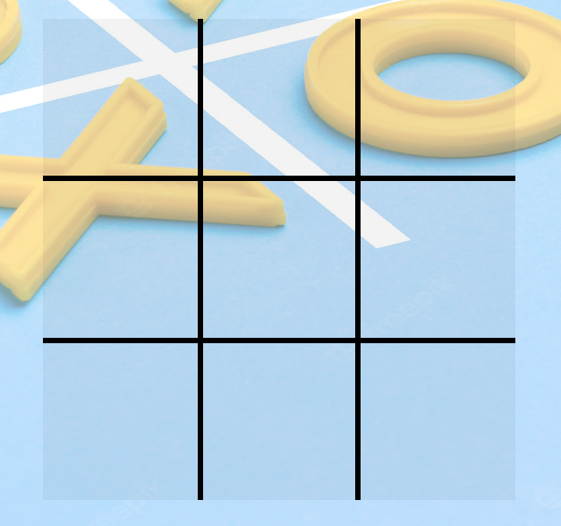
- Game baord has a hover css style applies to it so that when a user hovers over it, the tint changes to a slightly more blue colour highlighting the selected cell as well as the cursor changes to a pointer cursor.
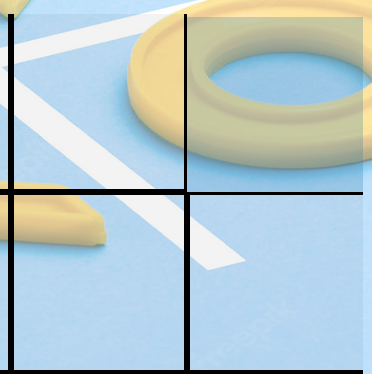

- Once the game board cells get clicked the marks will appear depending on who's turn it is. When user clicks there is a pop sound to indicate that a click has happened.
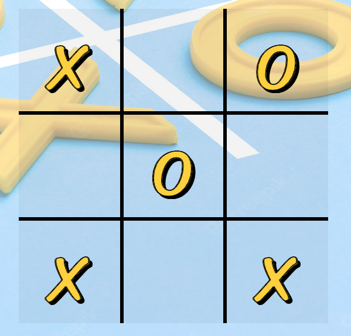

<audio controls><source src="./assets/audio/clickaudio.mp3" type="audio/ogg"></audio>

- The game board also has two marks on the sides of the board which indicate who's turn it is. They indicate this by swapping color to white depending on whos turn it is.
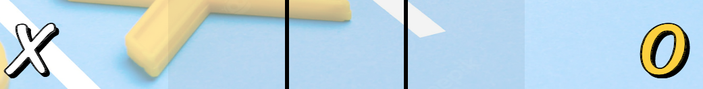

- Once the winner of a round is declared by the board the marks turn blue depending on which mark has won. 
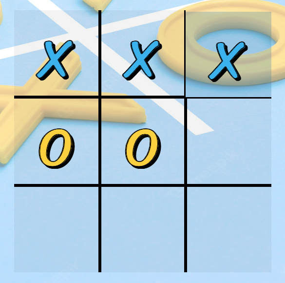

- Once a win or a tie has been settled, the game baord section will hide after a little delay to reveal the scoreboard and announce the winner.

### 3. Scoreboard
- The scoreboard consists of Player X and Player O score which goes up depending on how many round each won. with the win there's also an announcement that shows who won or if its a tie. 
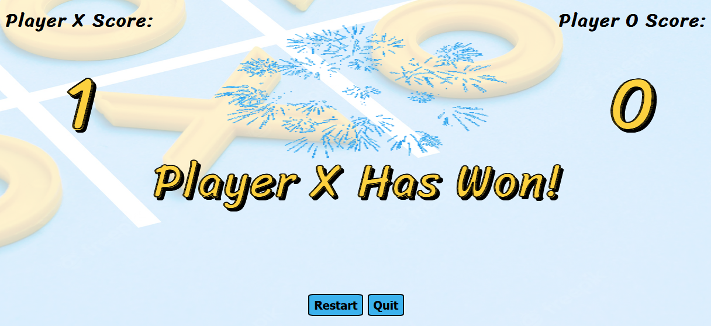
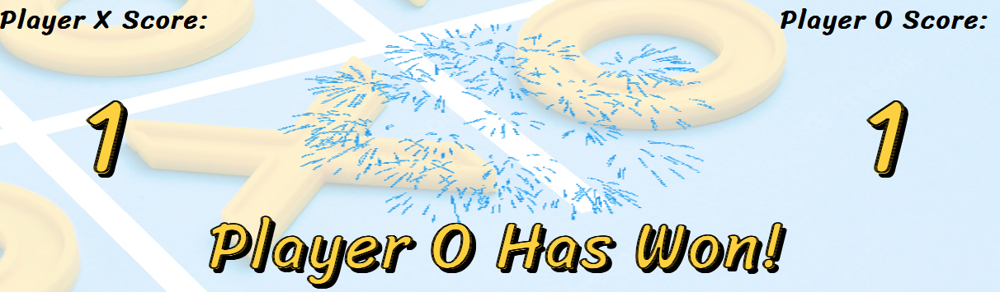
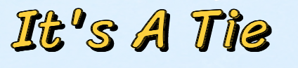

- In between the scores there's a blue firework gif as a little celebration gif of the games end. 
- At the bottom the the scoreboard theres two buttons one to reset the game and start a new round and one to quit the game which will take you to a thank you section.
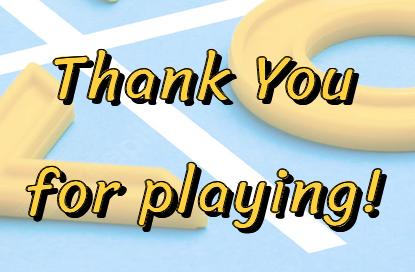

## Future Feature
- The future features I would like to add to the game are: 
    - Games against a computer with two difficulty levels, easy and hard. Easy will be the computer placing X/O randomly on the grid, and hard will be an actual 
    AI trying to win against you. 
    - Multiplayer games against other people, could be played across all platforms with internet access.

### Wireframes/Planning

## Testing
### Code Validation 
- The HTML code has been validated in the W3C Markup Validation Service and the HTML file haw came back with no errors.
- CSS Code has been validated in the W3C CSS Validation Service and all CSS code has came back with no errors (CSS level 3 + SVG)
- I have also used the lighthouse app on the page I have created to test for accessibility:

- JSHint at first got 9 warning due to 'jshint eversion 6', but after putting a comment on top of the JavaScript file '/*jshint esversion: 6 */' there's no faults. 

### Page testing
- Game rules 
    - The testing I have done on game rules section is mainly for the button and the function to change its dislay to none and show another section. The button has a hover css added to it and a pointer cursor. I have tested for that by hovering over and the result was darker shade of blue to highlight the mouse being over the button. 

    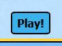
    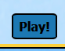

    - Tested the display functionality by simply pressing the 'Play!' button and the response was as expected.

- Gameboard
    - The gameboard had the most testing done to it. I tested everything as I was coding along, first tests were performed on the grid.
        - The grid has a hover class applied to as shown in the features, when a user hovers over it it changes the cells colour to slightly darker blue, which is an indicator for users to know thats the cell thats being selecte by them.
        - After ensuring the grid is responsive to the hover, I started to write the code that with a click of a mouse will put either a X mark or O mark depending on the users turn. I tested this by clicking every cell on the board to make sure every cells responds to the data input from JavaScript. 
        - Following the placement of X/O marks theres a pop audio to indicate a mark has been put down. When testing to see if each cell responds to clicks and places marks the audio was tested as well as they are coded to perform their functions at the same time.

    - Checking for wins and indication who won
        - The board has 8 combination where a win can occur, I had to test that every combination responds to having either 3* X or O mark in a row and will result in a win by playing few rounds and making sure that I had 3*X in 8 combinations and the same for the O mark. All have came back successfully and declared a win when in those combinations
        - To show the winning combinations and winning marks, the marks will return blue. This was just like testing for winning combinations to ensure the wins turn blue in every cell.
        - The game also has a draw function, the draw function responds only to when the grid is full, this was tested by filling out the grid and the expected result was a draw section which was a success.

    - Last function on the game board is who's turn it is
        - The two mark's on the board side indicate whos turn it is by turning white depending on whether it is X's turn or O's, this was tested by switching between turns and as expected the two marks were switching colours.
    
- Scoreboard
    - To get to the scoreboard section, the game has to result in a win or tie.
    - The main functions of the scoreboard is the score keeping and the who won or if tied announcer
        - The scores increments each time X/O wins, this was tested by playing few rounds and seeing if after each win it is adding the scores correctly. Which as expected it was.
        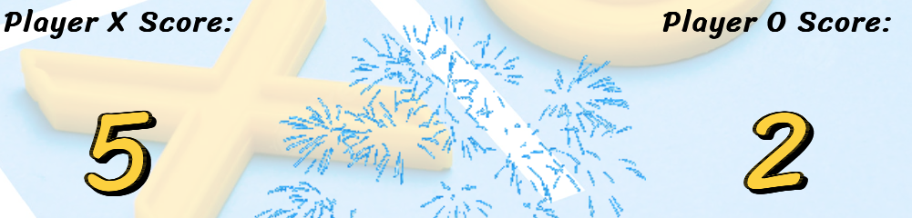
        - The who won or if tied was tested in the same way as the score keeping, by playing few rounds to see results, and as expected all returned successfully.
        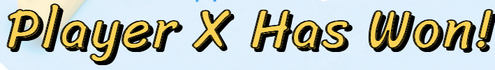
        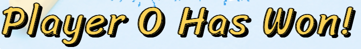
        

    - The scoreboard also consists of two buttons, Restart button and Quit button.
        - The restart button takes you back to the gameboard upon clicking it, and also restarts the game so another round can be played. 
        - Quit button takes you to the Thank you page after clicking it.
        - Both buttons have been tested by seeing the respons after clicking, and also both have hover css applied like the 'Play!' button.

## Fixed bugs
- Audio 
    - 
- Winner colour not resetting

## Unfixed bugs
- N/A

## Supported screens and Browsers
- 

## Deployment 
### Github
- Site was deployed to GitHub pages. The steps for deployment are as follows:
    - In the GitHub repository, navigate to the Setting Tab, then to the 'Pages' tab on the left
    - In the 'pages' tab find Source, press the dropdown menu and select 'Main' and save
    - Once saved, the page will provide a link to the completed website.

### Gitpod
- 
